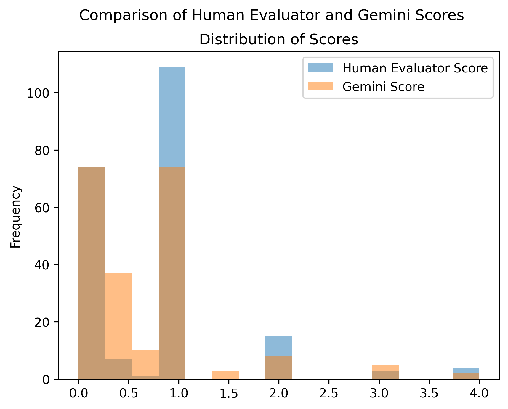

## Evalustion using LLM (gemini-1.5-flash)
#### Note the NoteBook might Not be reproducable LLM seed For Reproductivity isn't avilable YET

This repository contains Python notebooks and scripts for evaluating and scoring AI-generated responses using Google's Generative AI models. The main focus is on processing CSV files and generating insights based on the evaluation of model outputs.

## Model Evaluation Files

The following CSV files contain the evaluation results for different model versions. Each file includes scores and insights from the evaluations based on the Generative AI models.

- **`Final_evaluated_1.csv`**: Scores and insights for **Model Version 1**. This version's evaluation incorporated LLM (Gemini 1.5 Flash) feedback to refine response accuracy and relevance.
- **`Final_evaluated_2.csv`**: Scores and insights for **Model Version 2**. Similar to Version 1, this evaluation utilized LLM feedback to assess performance and ensure comprehensive analysis.
- **`Final_evaluated_3.csv`**: Scores and insights for **Model Version 3**. This last version also brought LLM evaluation into consideration, allowing for a consistent scoring methodology across all models.

### Contents

1. **Notebooks**
   - `llm-evaluation.ipynb`: Main notebook for evaluating AI responses with CSV data.
   - `ScoringINF_LLM.ipynb`: Notebook for processing and visualizing scores from the evaluations.

2. **Python Scripts**
   - `model_scoring1.py`: Script containing the `ModelScorer` class that computes performance scores for the model's responses.

### Installation

To run the notebooks and scripts locally, you'll need to set up your environment with the necessary packages. Use the following commands in your Jupyter Notebook or Python script environment:

```bash
%pip install -U -q "google-generativeai>=0.8.3"
```
> Note: You may need to restart the kernel to use updated packages.

### Configuration

You'll need to configure your Google API key to utilize the Generative AI model. Below is an example of how to set it up:

```python
import google.generativeai as genai
from kaggle_secrets import UserSecretsClient

# Set your Google API key for the Generative AI model
GOOGLE_API_KEY = UserSecretsClient().get_secret("GOOGLE_API_KEY")
genai.configure(api_key=GOOGLE_API_KEY)
```

### Usage

#### Evaluation Notebook: `llm-evaluation.ipynb`
In this notebook, you will:
- Load response data from CSV files.
- Evaluate the AI-generated answers based on alignment with expected answers using the configured Generative AI model.
- Save the evaluation results into new CSV files.

#### Scoring Script: `model_scoring1.py`
This script provides a `ModelScorer` class designed to calculate performance scores for the AI's responses based on accuracy and response time. You can initialize the scorer and compute scores as follows:

```python
from model_scoring1 import ModelScorer

scorer = ModelScorer(alpha=0.5, W_accuracy=0.8, W_time=0.2)
results_df = scorer.compute_scores(results_df)
```

#### Insights Notebook: `ScoringINF_LLM.ipynb`
In this notebook, you will:
- Load the evaluated results.
- Process the scores for visualization and analysis, including computing correlations, summary statistics, and various plots for better understanding.

### Example Outputs

After running the evaluations, the notebooks will generate total scores for each evaluated CSV as shown below:

- Total Gemini Score for `model_responses_with_time_tqdm1S.csv`: 45.9
- Total Gemini Score for `model_responses_with_time_tqdm2S.csv`: 48.58
- Total Gemini Score for `model_responses_with_time_tqdm3S.csv`: 47.3

### Visualizations

The second notebook visualizes the evaluation metrics, illustrating relationships and distributions of scores between human evaluators and the AI, with box plots, scatter plots, and histograms.



### License

This project is licensed under the MIT License. See the LICENSE file for details.

### Acknowledgements

- Google's Generative AI for providing powerful features for text generation and evaluation.
- The Kaggle community for resources and tools utilized in setting up this project.

### Contributing

If you would like to contribute to this project, feel free to fork the repository and submit a pull request. Your feedback and contributions are highly appreciated!
