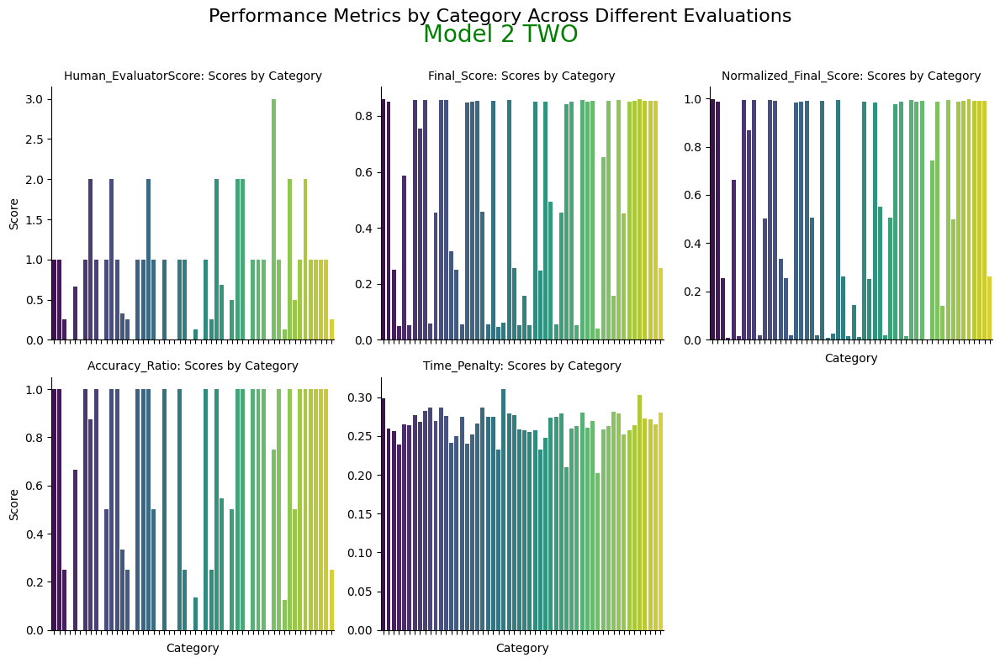

# Model Scoring Script

This Python module provides a scoring mechanism to evaluate the performance of a model based on two main factors:
1. **Accuracy**: How well the model performs relative to the maximum possible score for each category.
2. **Efficiency**: How quickly the model generates responses, with response time considered as a key factor.

### Requirements

To run this module, make sure you have the following Python packages installed:
- `pandas`: For handling DataFrames containing model results.
- `numpy`: For performing numerical operations, including calculating time penalties.

You can install these dependencies using pip:

```bash
pip install pandas numpy
```

### Functionality

The `ModelScorer` class calculates a final score for each row in the provided results DataFrame. The scoring is based on:

- **Accuracy**: The ratio of the model's score to the maximum possible score (\( \frac{\text{Human_EvaluatorScore}}{\text{Max_Score}} \)).
- **Response Time**: A time penalty is applied using a logarithmic transformation to reduce the impact of outliers in response time. Faster responses (lower times) yield higher scores.

### Final Score Calculation

The final score is calculated using the formula:

\[
\text{Final Score} = \left( W_{\text{accuracy}} \times \frac{\text{Human_EvaluatorScore}}{\text{Max_Score}} \right) + \left( W_{\text{time}} \times \frac{1}{\log(\text{Response Time})} \right)
\]

Where:
- \( W_{\text{accuracy}} \) (default 0.8) is the weight for the accuracy factor.
- \( W_{\text{time}} \) (default 0.2) is the weight for the response time penalty.

The logarithmic transformation compresses the effect of very slow responses, ensuring that outliers do not disproportionately affect the score.

### Features
- **Accuracy Ratio**: Performance normalized by the maximum possible score for each category.
- **Time Penalty**: Faster responses are rewarded, while slower responses are penalized.
- **Final Score**: A composite score that integrates accuracy and response time.
- **Normalized Final Score**: The final score normalized to a [0, 1] range for easier comparisons across categories.

### Class: ModelScorer

#### Methods

- `__init__(self, alpha=0.5, W_accuracy=0.8, W_time=0.2)`: Initializes the scorer with the specified parameters.
- `compute_scores(self, results_df)`: Computes scores for the provided DataFrame and returns it with additional columns: `Accuracy_Ratio`, `Time_Penalty`, `Final_Score`, and `Normalized_Final_Score`.

### Example Usage

Import the module and utilize it as follows:

```python
from model_scoring import ModelScorer
import pandas as pd

# Sample data (replace with your actual DataFrame)
data = {
    'category': ['A', 'B', 'C'],
    'Human_EvaluatorScore': [8, 9, 7],
    'Max_Score': [10, 10, 8],
    'response_time': [1.2, 2.5, 0.8]
}

results_df = pd.DataFrame(data)

# Initialize the scorer
scorer = ModelScorer(alpha=0.5, W_accuracy=0.8, W_time=0.2)

# Compute the scores
results_df = scorer.compute_scores(results_df)

# Display the results
print(results_df[['category', 'Final_Score', 'Normalized_Final_Score']])
```

### Output Example

The output DataFrame will include the following columns:

```
  category  Final_Score  Normalized_Final_Score
0        A      0.8326                  0.8051
1        B      0.9507                  0.9647
2        C      0.6354                  0.0000
```

### Customization

You can easily adjust the weights and sensitivity by modifying the following parameters upon initializing the `ModelScorer`:
- **W_accuracy**: Adjust the weight for accuracy.
- **W_time**: Adjust the weight for the time penalty.
- **alpha**: Adjust the logarithmic scaling of the response time.

### License

This project is licensed under the MIT License.

---

### How to Use:

1. **Clone the repository** or place the script `model_scoring.py` into your project folder.
2. **Import** the `ModelScorer` class into your Python code.
3. **Initialize** the `ModelScorer` instance with your desired parameters.
4. **Call** the `compute_scores` method with your DataFrame containing `Human_EvaluatorScore`, `Max_Score`, and `response_time`.
5. The method will return the DataFrame enriched with additional score columns.

### Visualization

This is the end result of this model category-wise, illustrating the Human Evaluation Score by category to Time Penalty by category:

