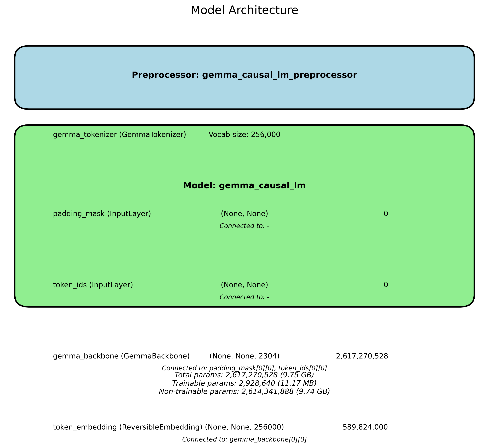

### Components of the Model Architecture

1. **Preprocessor Block**
   - **GemmaTokenizer**: This is a tokenization step that transforms raw text into a format that the model can understand. Tokenizers typically split text into smaller units (tokens) based on linguistic rules or vocabulary. The vocabulary size mentioned (256,000) indicates the number of unique tokens the tokenizer can recognize; this can include words, subwords, and special characters.

   - **Vocab size**: The vocabulary size determines how many distinct tokens the model can process. A larger vocabulary can capture more nuances in different languages or domain-specific terminologies but may also require more parameters, making the model larger and more complex.

2. **Model Block**
   - **Input Layers**:
     - **Padding Mask**: This input layer is often used in sequence models to manage varying lengths of input sequences. The padding mask helps the model ignore padded parts of the input during processing, ensuring that these do not affect the output or learning.
     - **Token IDs**: Another input layer that takes the token representations of the input text.

   - **GemmaBackbone**: This component likely refers to the main transformer architecture behind the model. It handles the bulk of the computations and transformations of the input data. The output shape `(None, None, 2304)` suggests that this backbone can process sequences (the first `None`) of variable length (the second `None`) and produces an embedding of size `2304`. The number of parameters (over 2.6 billion) indicates that this backbone has considerable complexity and capacity to learn from data.

   - **Token Embedding**: This layer converts token IDs into dense vectors (embeddings), allowing the model to represent the tokens in a continuous space where similar tokens are closer together. The output shape indicates it can output a representation for `256,000` unique tokens.

3. **Parameters**:
   - **Total Params**: The architecture has over 2.6 billion parameters, which gives it substantial capacity to learn from large datasets but also implies significant resource requirements (both in terms of memory and computational time).
   - **Trainable Params vs. Non-Trainable Params**: The model has a smaller number of trainable parameters (approx. 2.9 million), which can be fine-tuned during training, while the majority of parameters (approx. 2.6 billion) are non-trainable, indicating they are part of the pre-trained backbone. This is a common strategy in transfer learning where the base model is kept intact, and only the parts specific to the task are fine-tuned.

### Implications of the Architecture

- **Performance**: The design suggests that the model can effectively capture semantic relationships and contextual information in textual data, making it suitable for various NLP tasks such as text classification, generative tasks, translation, etc.
  
- **Scalability**: Given the large number of parameters, the model can be scaled to process larger datasets, but it will require significant computational resources and careful management of training processes (e.g., through techniques like gradient accumulation or mixed precision training).

- **Training**: Fine-tuning such a model on a specific task often requires a considerable amount of labeled data, and the training process can be resource-intensive due to the large amount of data processed during training iterations.

- **Applicability**: The architecture can be adapted for various applications in NLP, such as chatbots, sentiment analysis, named entity recognition (NER), and summarization tasks.

Overall, this model architecture reflects a sophisticated approach to leveraging transformer technology for language understanding and generation, enabling advanced capabilities in the field of AI and machine learning.