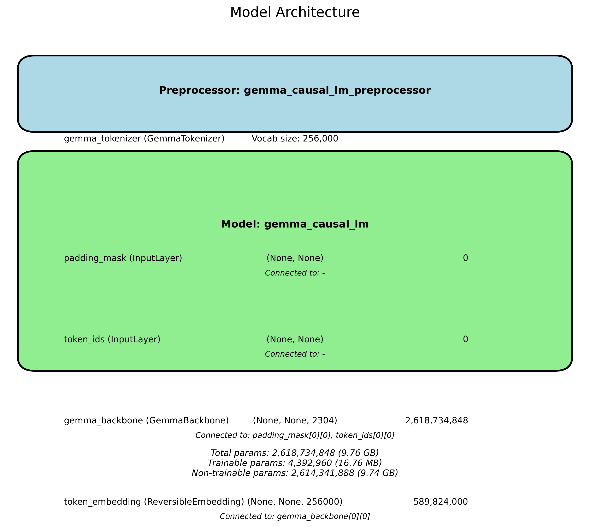

### Model Architecture Explained

#### 1. **Preprocessor Block**
- **Purpose**: The preprocessor stage is critical for transforming raw input text into a format suitable for processing by the model. It often involves tokenization, encoding, and other necessary transformations to prepare the data.

- **GemmaTokenizer**: This specific tokenizer is likely designed to convert text into a set of tokens that the model can process. The mention of a vocabulary size of **256,000** indicates that it can handle a substantial range of tokenized input, which is particularly useful for dealing with diverse datasets and languages.

    - **Vocab Size**: The larger the vocabulary, the more nuanced the understanding of the text can be, as it includes more specific and varied terms, jargon, and possibly subword units.

#### 2. **Model Block**
- The model block is where the main operations occur. It takes the preprocessed inputs and applies the core model architecture to perform computations and generate outputs.

- Components include:
    - **padding_mask (InputLayer)**: This input layer ensures that during batch training, padded sequences (used to make all inputs of the same length) do not affect the learning process. The mask tells the model which parts of the input are valid and which are just padding.
    
    - **token_ids (InputLayer)**: Another input layer that receives the actual tokenized representation of the text, allowing the model to interpret the sequences of word tokens.

    - **gemma_backbone (GemmaBackbone)**: This is likely the central part of the model architecture, employing a transformer-based backbone designed for complex and contextualized processing of the input data. The shape of `(None, None, 2304)` indicates it processes batches of variable-length sequences and produces embeddings of size `2304` for each token in the sequence.

        - **Parameters**: The Gemma backbone has an impressive **2,618,734,848** parameters. This significant parameter count suggests high capacity for learning patterns and relationships in the data but implies significant computational resources are required.

    - **token_embedding (ReversibleEmbedding)**: This layer transforms token IDs into dense vector representations. The output shape `(None, None, 256000)` indicates that the model embeds the input tokens into a continuous space characterized by 256,000-dimensional representations, enhancing the model's capability to understand language semantics.

#### 3. **Parameter Statistics**
- The summary at the bottom provides totals for model parameters:
    - **Total Parameters**: **2,618,734,848** parameters in total (approximately **9.76 GB**), indicating how large and sophisticated the model is overall.
    - **Trainable Parameters**: Only a smaller fraction (**4,392,960**) is trainable during fine-tuning, suggesting most parameters were pre-trained and are now effectively utilized directly.
    - **Non-trainable Parameters**: The majority (**2,614,341,888**) are non-trainable, meaning they come from the pre-trained backbone of the model and help in initializing it with learned features from extensive datasets.

### Implications of the Architecture

1. **Performance in NLP Tasks**: This architecture is designed for high performance in various natural language processing tasks such as text generation, sentiment analysis, machine translation, etc. The transformer architecture it's based on enables it to capture long-range dependencies in text and understand context better than traditional models.

2. **Scalability and Efficiency**: Given the size of the model, it is scalable for tasks involving large datasets and can capture a wealth of features and relationships within those datasets. The trade-off is the requirement of substantial computational resources, both during training and inference.

3. **Transfer Learning**: The architecture suggests that it benefits from pre-training on vast datasets, making it applicable for fine-tuning on specific downstream tasks. This is common in NLP models today, where model weights trained on general tasks are adapted to more specialized applications.

4. **Use Case Versatility**: The architecture is versatile enough for numerous applications, making it suited for industries ranging from chatbots and conversational AI to analytical tools for sentiment detection and content generation.

In summary, the model architecture you have outlined represents a powerful and versatile tool in the realm of natural language processing, characterized by its robust design and large capacity for learning from data, driven primarily by the transformer backbone technology.